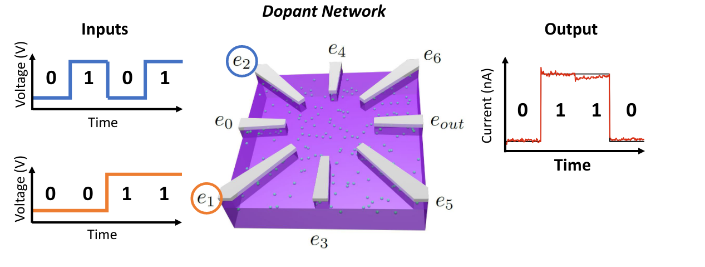
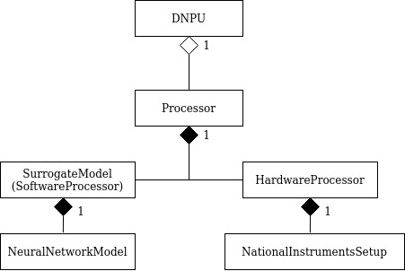

# Summary

Projections about the limitations of digital computers for deep learning models are leading to a shift towards domain-specific hardware, where novel analogue components are sought after, due to their potential advantages in power consumption. This paper introduces brains-py, a generic framework to facilitate research on different sorts of disordered nano-material networks for natural and energy-efficient analogue computing. Mainly, it has been applied to the concept of dopant network processing units (DNPUs), a novel and promising CMOS-compatible nano-scale tunable system based on doped silicon with potentially very low-power consumption at the inference stage. The framework focuses on two material-learning-based approaches, for training DNPUs to compute supervised learning tasks: evolution-in-matter and surrogate models. While evolution-in-matter focuses on providing a quick exploration of newly manufactured single DNPUs, the surrogate model approach is used for the design and simulation of the interconnection between multiple DNPUs, enabling the exploration of their scalability. All simulation results can be seamlessly validated on hardware, saving time and costs associated with their reproduction. The framework is generic and can be reused for research on various materials with different design aspects, providing support for the most common tasks required for doing experiments with these novel materials.

# Statement of need

The breakthroughs of deep learning come along with high energy costs, related to the high throughput data-movement requirements for computing them. The increasing computational demands of these models, along with the projected traditional hardware limitations, are shifting the paradigm towards innovative hardware solutions, where analogue components for application-specific integrated circuits are keenly sought [@kaspar2021rise]. Dopant network processing units (DNPUs) are a novel concept consisting of a lightly doped semiconductor, edged with several electrodes, where hopping in dopant networks is the dominant charge transport mechanism [@chen2020classification, @ruiz2021dopant] (See Figure 1). The output current of DNPUs is a non-linear function of the input voltages, which can be tuned for representing different complex functions. The process of finding adequate control voltages for a particular task is called training. Once the right voltage values are found, the same device can represent different complex functions on demand. The main advantages of these CMOS-compatible devices are the very low currents, their multi-scale tunability on a high dimensional parameter space, and their potential for extensive parallelism. Devices based on this concept enable the creation of potentially very low energy-consuming hardware for computing deep neural network (DNN) models, where each DNPU has a projected energy consumption of over 100 Tera-operations per second per Watt [@chen2020classification]. This concept is still in its infancy, and it can be developed in diverse ways. From various types of materials (host and dopants) to distinct dopant concentrations, different device dimensions or the number of electrodes, as well as different combinations of data-input, control and readout electrodes. Also, there are different ways in which DNPU-based circuits could be scaled up, and having to create hardware circuits from scratch is an arduous and time-consuming process. For this reason, this paper introduces brains-py, a generic framework to facilitate research on different sorts of disordered nano-material networks for natural and energy-efficient analogue computing. To the extent of the knowledge of the authors, there is no other similar works on the area.

# Framework description

The framework is composed of two main packages, brains-py (core) and brainspy-smg (surrogate model generator). The former package contains the whole structure for processors, managing the drivers for National Instruments devices that are connected to the DNPUs, and a set of utils functions that can be used for managing the signals, custom loss/fitness functions, linear transformations and i/o file management. The latter package contains the libraries required to prepare DNPU devices for data gathering (multiple and single IV curves), to gather information from multi-terminal devices in an efficient way [@ruiz2020deep], as well as training support for surrogate models, and consistency checks.

# Finding functionality on a single DNPU circuit design

There are two main flavours in which single DNPUs can be trained: *Evolution in Matter* or *Surrogate model based gradient descent*. The *evolution in matter* approach performs a stochastic search for suitable control voltages for a single DNPU unit, measured in hardware, for a given supervised task [@sivanandam2008genetic]. It provides a quicker exploration (directly on hardware) of the usefulness of newly manufactured single DNPUs. Typically, common classification benchmarks are used, such as solving non-linear boolean gates [@chen2020classification] or measuring the Vapnik-Chervonenkis dimension [@ruiz2021dopant]. On the other hand, the *surrogate model* approach [@ruiz2020deep] is better suited for studying the scaling of DNPU hardware. The process is as follows:

1. Generate a surrogate model: For this, the multi-dimensional input-output data of the device is densely sampled. The input consists of sinusoidal or triangular modulation functions, chosen in such a way that the ratios of all frequency combinations are irrational, guaranteeing a densely covered input-output space without repetitions. A DNN is trained for representing the function of this input-output data.

2. Train for DNPU functionality: The weights of the trained DNN are frozen, and the control voltages are declared as learnable parameters of the surrogate model of the DNPU. The training for DNPU functionality is supported by the brains-py framework but is also possible to use customised user-created gradient descent [@dogo2018comparative] algorithms using PyTorch.

3. Validate on hardware: Once satisfactory control voltages for a task are found, brains-py supports seamlessly validating them on hardware, without having to modify the code of the model, by simply changing the model to hardware-evaluation mode.

# Finding functionality on multi-DNPU circuit design

One of the main aims of the framework is to explore different ways in which DNPU-based circuits can be scaled up. Developers can create experiments using several surrogate models in a custom PyTorch module, in a very similar way to how they would do it to create a custom neural network with PyTorch (It allows to create your own module that is a *torch.nn.Module* class child or *lightning.LightningModule* child from the Pytorch Lightning library). In this way, they can explore different ways of interconnecting DNPUs, and analyse their performance. Any experiment based on surrogate model simulations can then be validated on hardware with minor changes required on the code. In this way, early proof-of-concept hardware can be prototyped fast, avoiding having to develop again the experiments for hardware, which would otherwise be cumbersome to reproduce. Common programming tasks such as loading datasets, creating training loops, optimisers and loss functions required to implement the supervised learning task can be programmed in a very similar way to how it would be done with any regular gradient descent implementation in PyTorch [@paszke2019pytorch] and/or PyTorch Lightning [@lightning]. For providing validation on hardware with small code modifications, the brains-py library leverages the concept of '*Processor*', which allows changing the internal behaviour of the class to measure on simulations or hardware measurements, while maintaining an equivalent behaviour for the public methods. Internally, the *Processor* class also deals with the differences between input/output signals that are inherent to measuring in hardware or simulations (*e.g.*, noise or length of signal). This greatly facilitates the reuse of the same code for simulations and hardware measurements. Without this feature, the research on these materials becomes difficult and time-consuming to reproduce in hardware. The library also provides programmers with additional modules, which are associated to a *Processor* by an aggregation relationship, that can already replicate the scaling of DNPUs in ways that are known to work well (see Figure 2):

- *DNPU*: It is a very similar class to that of a *Processor*, but it contains the control voltages, declared as learnable parameters. Therefore, it only has the same input dimensions as the number of available data input electrodes. It is also a child of *torch.nn.Module*, and it allows for representing a layer of DNPUs in a time-multiplexing fashion (with the same Processor instance). It also enables applying linear transformations to the inputs before passing them to the processor.

- *DNPUBatchNorm*: It is a child of the *DNPU* class, and it also facilitates the incorporation of a batch normalisation layer after the output, which has been shown to produce better results [@ruiz2021dopant]. It also enables logging outputs before and after normalisation.

- *DNPUConv2d*: It is a child of the *DNPU* class, and it enables the processing of the information in the same way as a convolution layer would do, for different kernel dimensions. In each     case, a number of devices in parallel (time-multiplexed) will represent a kernel (e.g., for a 3x3 convolution, a layer of three eight-electrode devices can be used, where each device has 3 data-input electrodes and a single output). This layer can be used to reproduce computation with DNPUs using convolutional neural network (CNN) layers, and replicate existing deep-learning models.

# Conclusions and future research lines

We introduce a framework for facilitating the characterisation of different materials that can be used for energy-efficient computations in the context of machine learning hardware development research. It supports developers during typical tasks required for the mentioned purpose, including preliminary direct measurements of devices, the gathering of data and training of surrogate models, and the possibility to seamlessly validate simulations of surrogate models in hardware. In this way, researchers can save a significant amount of energy and resources when exploring the abilities of different DNPU materials and designs for creating energy-efficient hardware. The libraries have been designed with reusability in mind.

# Projects

The tool is primarily used in the Center for Brain-Inspired NanoSystems, which
includes the MESA+ Institute for Nanotechnology, the Digital Society Institute and
the Faculty of Behavioural, Management and Social sciences. It has been used for several projects:

1. HYBRAIN – Hybrid electronic-photonic architectures for brain-inspired computing

        Project funded by the European Union's Horizon Europe research and innovation         programme under Grant Agreement No 101046878

        [https://hybrain.eu/](https://hybrain.eu/)

2. Collaborative Research Centre on Intelligent Matter (CRC 1459)

        Project funded by the Deutsche Forschungsgemeinschaft (DFG, German Research         Foundation) through project 433682494 - [SFB 1459 - Intelligent Matter - University of Münster](https://www.uni-muenster.de/SFB1459/)

3. Evolutionary Computing using Nanomaterial Networks

        Project funded by the Dutch Research Council (NWO) Natuurkunde Projectruimte         Grant No. 680-91-114

4. Nanomaterial Networks for Artificial Intelligence in the Automotive Industry: NANO(AI)2

        Project funded by the Dutch Research Council (NWO) Natuurkunde Projectruimte         Grant No. 16237 DFG, German Research Foundation) through project 433682494 –         SFB 1459

Within the scope of the above projects, several PhDs and Master Students have developed and are developing code based on this library.

# Related publications

**Hopping-Transport Mechanism for Reconfigurable Logic in Disordered Dopant Networks**  
Henri Tertilt, Jesse Bakker, Marlon Becker, Bram de Wilde, Indrek Klanberg, Bernard J. Geurts,  
Wilfred G. van der Wiel, Andreas Heuer, and Peter A. Bobbert  
[Phys. Rev. A **17**, 064025 (2022)](https://journals.aps.org/prapplied/abstract/10.1103/PhysRevApplied.17.064025)

**Dopant Network Processing Units: Towards Efficient Neural-network Emulators with High-capacity Nanoelectronic Nodes**  
Hans-Christian Ruiz Euler, Unai Alegre-Ibarra, Bram van de Ven, Hajo Broersma, Peter A. Bobbert, Wilfred G. van der Wiel  
[Neuromorph. Comput. Eng. **1**, 024002 (2021)](https://iopscience.iop.org/article/10.1088/2634-4386/ac1a7f)

**1/*f* noise and machine intelligence in a nonlinear dopant atom network**  
Tao Chen, Peter A. Bobbert and Wilfred G. van der Wiel  
[Small Science 202000014 (2021)](https://doi.org/10.1002/smsc.202000014)

**A deep-learning approach to realizing functionality in nanoelectronic devices**  
Hans-Christian Ruiz Euler, Marcus N.
Boon, Jochem T. Wildeboer, Bram van de Ven, Tao Chen, Hajo Broersma,
Peter A. Bobbert and Wilfred G. van der Wiel  
[Nature Nanotechnology **15**, 992-998 (2020)](https://www.nature.com/articles/s41565-020-00779-y)

**Classification with a disordered dopant-atom network in silicon**T. Chen, J. van Gelder, B. van de Ven, S. Amitonov, B. de Wilde, H.-C. Ruiz Euler,  
H. J. Broersma, P. A. Bobbert, F. A. Zwanenburg, W.G. van der Wiel [Nature **577**, 341-345 (2020)](https://doi.org/10.1038/s41586-019-1901-0)

# Acknowledgements

This project has received financial support from the University of Twente, the Dutch Research Council ( HTSM grant no. 16237 and Natuurkunde Projectruimte grant no. 680-91-114 ) as well as from Toyota Motor Europe N.V. We acknowledge financial support from the HYBRAIN project funded by the European Union's Horizon Europe research and innovation programme under Grant Agreement No 101046878. This work was further funded by the Deutsche Forschungsgemeinschaft (DFG, German Research Foundation) through project 433682494 – SFB 1459.

# References
